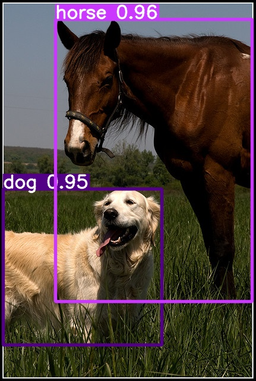

# Triton Inference Server Client For YOLO Models

Triton Inference Server is an open source inference serving software that streamlines AI inferencing. Triton enables teams to deploy any AI model from multiple deep learning and machine learning frameworks, including TensorRT, TensorFlow, PyTorch, ONNX, OpenVINO, Python, RAPIDS FIL, and more. 

This repository is a Python-based client application designed for seamless communication with the Triton Inference Server. It is optimized for compatibility with the Yolov9 model and models converted to FP16 precision. <br>
This repository is a continuation of the work on Triton Client by Philipp Schmidt, available [here](https://github.com/philipp-schmidt/yolov7/tree/triton-deploy/deploy/triton-inference-server).


## Install Repository
``` bash
git clone https://github.com/asdemirel/triton-client-yolov9.git
cd triton-client-yolov9
pip3 install -r requirements.txt    
```

### Prerequisite 
Start Triton Inference Server

### Running Triton Inference Server Client

```bash

python3 client.py image --model images/test.jpg --half

```


```
$ python3 client.py --help
usage: client.py [-h] [-m MODEL] [--width WIDTH] [--height HEIGHT] [-u URL] [-o OUT] [-f FPS] [-i] [-v] [-t CLIENT_TIMEOUT] [-s] [-r ROOT_CERTIFICATES] [-p PRIVATE_KEY] [-x CERTIFICATE_CHAIN] {dummy,image,video} [input] [--half]

positional arguments:
  {dummy,image,video}   Run mode. 'dummy' will send an emtpy buffer to the server to test if inference works. 'image' will process an image. 'video' will process a video.
  input                 Input file to load from in image or video mode

optional arguments:
  -h, --help            show this help message and exit
  -m MODEL, --model MODEL
                        Inference model name, default yolov7
  --half                FP16 half-precision export
  --width WIDTH         Inference model input width, default 640
  --height HEIGHT       Inference model input height, default 640
  -u URL, --url URL     Inference server URL, default localhost:8001
  -o OUT, --out OUT     Write output into file instead of displaying it
  -f FPS, --fps FPS     Video output fps, default 24.0 FPS
  -i, --model-info      Print model status, configuration and statistics
  -v, --verbose         Enable verbose client output
  -t CLIENT_TIMEOUT, --client-timeout CLIENT_TIMEOUT
                        Client timeout in seconds, default no timeout
  -s, --ssl             Enable SSL encrypted channel to the server
  -r ROOT_CERTIFICATES, --root-certificates ROOT_CERTIFICATES
                        File holding PEM-encoded root certificates, default none
  -p PRIVATE_KEY, --private-key PRIVATE_KEY
                        File holding PEM-encoded private key, default is none
  -x CERTIFICATE_CHAIN, --certificate-chain CERTIFICATE_CHAIN
                        File holding PEM-encoded certicate chain default is none
```
